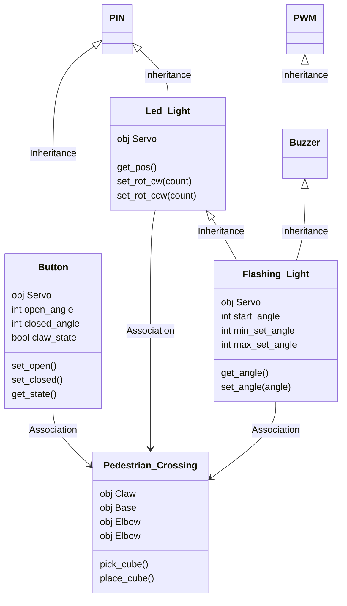

# Learn MicroPython Raspberry Pi Pico

This repository is a mini OOP based project to explicitly teach Object Oriented Paradigm programming concepts specifically in the microcontroller context.

Students will be recreating a model of the pedestrian crossing on Unwins Bridge Road out the front of Tempe High School.

From the above real world control system we will model:

- Overloading and overriding polymorphism
- Inheritance, multilevel inheritance and multi class inheritance
- Abstraction
- Decomposition and composition
- Generalisation
- Encapsulation
- Object instantiation, objects as instance variables

## Wire your system

### Components

- Breadboard
- Momentary switch
- 5x LED
- 1x Piezo buzzer
- 5x 220Ω resistors
- Jumper leads
- Pi Pico

### Pin allocation

| Pin  |                      |
| ---- | -------------------- |
| GP3  | Red LED              |
| GP4  | Keyboard Interrupt   |
| GP5  | Amber LED            |
| GP7  | Red LED              |
| GP17 | Flashing Green LED   |
| GP19 | Flashing Red LED     |
| GP22 | Button signal        |
| GP27 | Piezo Buzzer         |
| GND  | Circuit Ground       |
| 3V3  | Button logic voltage |

## UML Diagram

> [!Note]
> Inheritance and association labels are note required in a UML diagram but have been added for understanding.

## Versions

| Version | Notes                                                                                                                     |
| ------- | ------------------------------------------------------------------------------------------------------------------------- |
| v01.py  | Basic "Blink" Program (the Hello World of mechatronics).                                                                  |
| v02.py  | Test wiring and use basic methods from parent `Pin` class.                                                                |
| v03.py  | Implement a child class of MicroPython `Pin` class for the traffic lights, demonstrating Inheritance and Polymorphism.    |
| v04.py  | Move the `Led_Light` class to a separate file, demonstrating abstraction.                                                 |
| v05.py  | Write a `Button` class and test it by instantiating it and controlling the `red_light` instance of the `Led_Light` class. |
| v06.py  | Implement a Event Trigger for when the button has been pressed.                                                           |
| v07.py  | Debounce the button.                                                                                                      |

<a property="dct:title" rel="cc:attributionURL" href="https://github.com/TempeHS/TempeHS_PI_Pico_Boilerplate">TempeHS Pi Pico Boilerplate
</a> by <a rel="cc:attributionURL dct:creator" property="cc:attributionName" href="https://github.com/benpaddlejones">Ben Jones</a> is licensed under <a href="https://creativecommons.org/licenses/by-nc-sa/4.0/?ref=chooser-v1" target="_blank" rel="license noopener noreferrer" style="display:inline-block;">Creative Commons Attribution-NonCommercial-ShareAlike 4.0 International</a>

