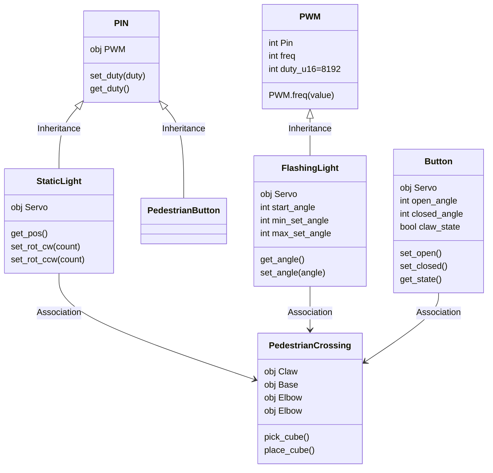

# Learn MicroPython Raspberry Pi Pico

This repository is a mini OOP based project to explicitly teach Object Oriented Paradigm programming concepts specifically in the microcontroller context.

Students will be recreating a model of the pedestrian crossing on Unwins Bridge Road out the front of Tempe High School.

From the above real world control system we will model:

- The two traffic lights which are synchronised and loop.
- The two pedestrian warning lights which are also synchronised.
- The two pedestrian buttons which break the traffic lights loop.
- The control system that manages the state of the components (large grey box).

## Wire your system

Components

- Breadboard
- Momentary switch
- 5x LED
- 5x 220Ω resistors
- Jumper leads
- Pi Pico

## UML Diagram

> [!Note]
> Inheritance and association labels are note required in a UML diagram but have been added for ease of reading.

## Versions

| Version | Notes                                  |
| ------- | -------------------------------------- |
| V01.py  | Test wiring and use basic methods from |

<a property="dct:title" rel="cc:attributionURL" href="https://github.com/TempeHS/TempeHS_PI_Pico_Boilerplate">TempeHS Pi Pico Boilerplate
</a> by <a rel="cc:attributionURL dct:creator" property="cc:attributionName" href="https://github.com/benpaddlejones">Ben Jones</a> is licensed under <a href="https://creativecommons.org/licenses/by-nc-sa/4.0/?ref=chooser-v1" target="_blank" rel="license noopener noreferrer" style="display:inline-block;">Creative Commons Attribution-NonCommercial-ShareAlike 4.0 International</a>

