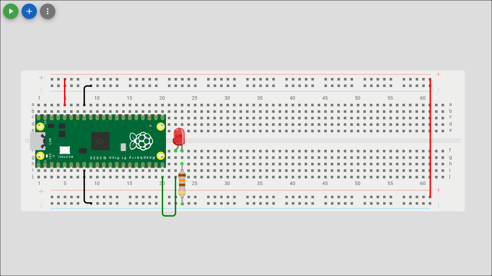
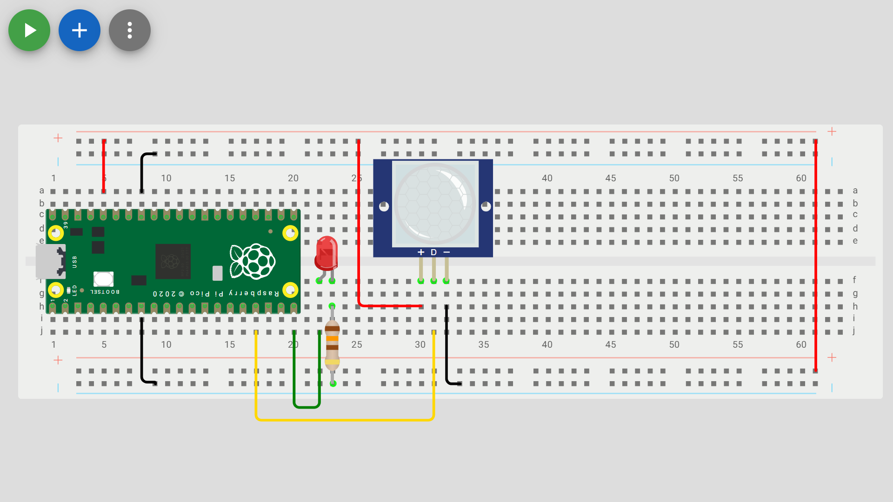
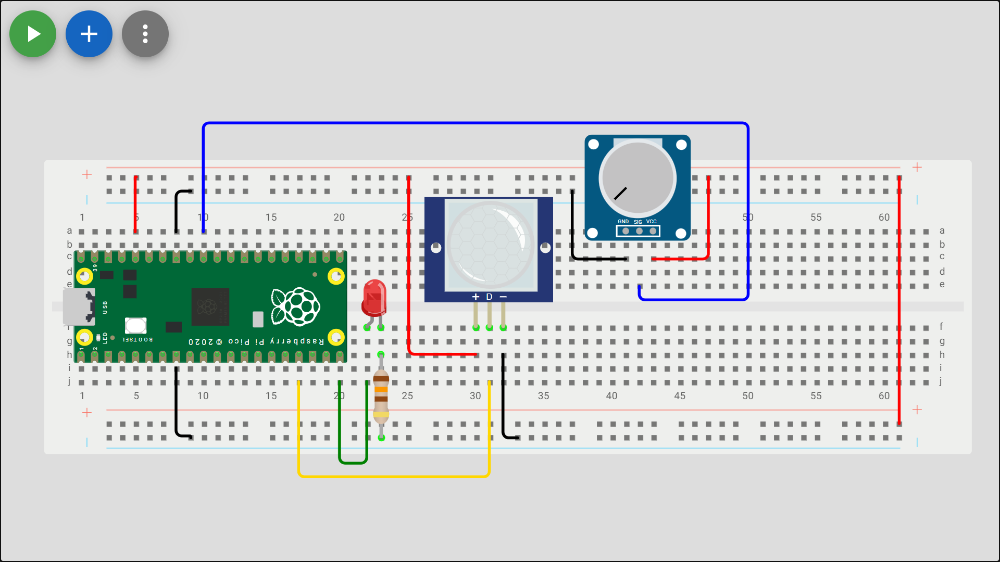
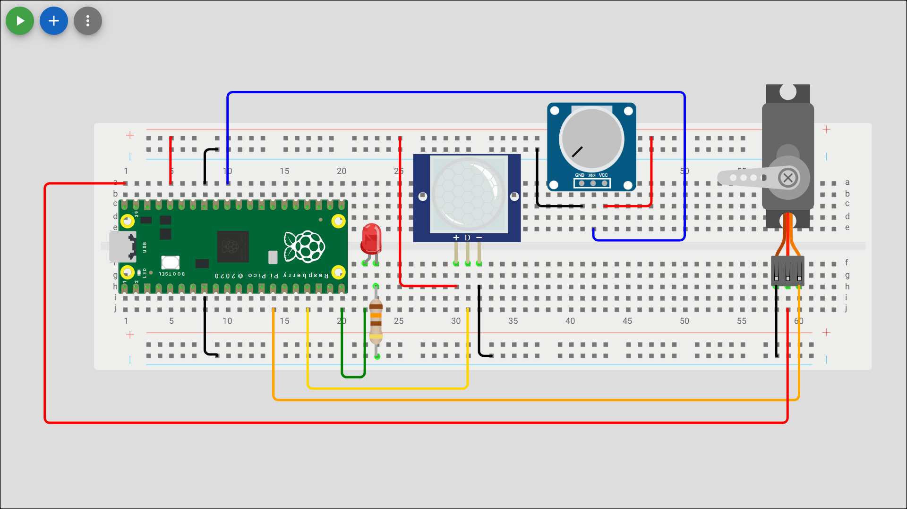
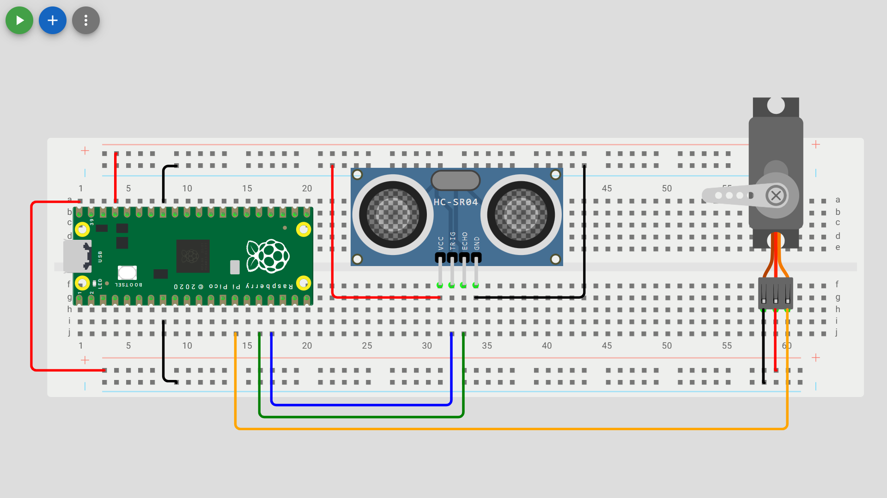
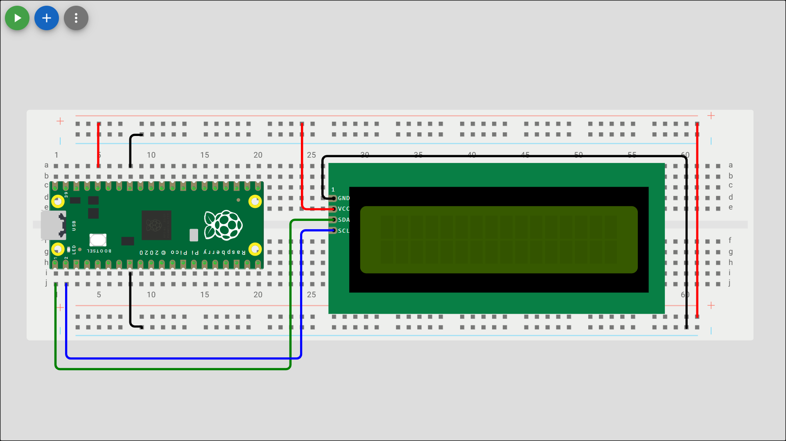

# Lecture 0

## Lecture 0 Concepts

- Introduction Projects
- Prototyping & Unit Testing in Wokwi
- Physically Wiring

## Introduction Projects

The Introduction projects should be completed before starting the OOP Mini Project. Ultimately, students should have a basic understanding of the following concepts: different sensors and actuators, wiring a breadboard, Unit Testing, and debugging software and hardware.

  <figure style="text-align: center;">
    
    <figcaption>Blink LED</figcaption>
  </figure>
  <figure style="text-align: center;">
    
    <figcaption>Digital Sensor</figcaption>
  </figure>
  <figure style="text-align: center;">
    
    <figcaption>Analog Sensor</figcaption>
  </figure>
  <figure style="text-align: center;">
    
    <figcaption>Servo Control</figcaption>
  </figure>
  <figure style="text-align: center;">
    
    <figcaption>Ultrasonic Sensor</figcaption>
  </figure>
  <figure style="text-align: center;">
    
    <figcaption>I2C Module</figcaption>
  </figure>

## Wokwi

Wokwi is an online Electronics simulator. You can use it to simulate Arduino, ESP32, STM32, and many other popular boards, parts and sensors. We will be using it for Pi Pico, you can also use the integrated IDE.

Students can sign up or in with OAuth using either their School Google Account or GitHub account.

1. [Wokwi](https://wokwi.com/)
2. [Wokwi Introduction Video](https://www.youtube.com/watch?v=s4QKFw8fh-4)
3. [Wokwi Pi Pico Docs](https://docs.wokwi.com/parts/wokwi-pi-pico)

> [!Note]
> Students using Wokwi should start with [Template Wokwi Project](https://wokwi.com/projects/433242006092880897).

### Wokwi Prototype

### Wokwi Unit Testing

First students should copy the provided script [v02.py](..\project\py_scripts\v02.py) into the terminal. 

1. All 5 LEDs should illuminate.
2. The buzzer should emit animated musical note on screen and if volume is turned up a constant tone.
3. The momentary switch should return `1` to the IDE terminal when closed (pressed) and 0 when not closed (depressed).

## Physical Wiring

Watch the [Pi Pico Breadboard Introduction Video](https://www.youtube.com/watch?v=Ex7AJll-FsM). Students should wire their board, then unit test using the provided script [v02.py](..\project\py_scripts\v02.py). 

### Physical Prototype

### Physical Unit Testing

1. All 5 LEDs should illuminate.
2. The buzzer should emit a constant tone.
3. The momentary switch should return `1` to the IDE terminal when closed (pressed) and 0 when not closed (depressed).
