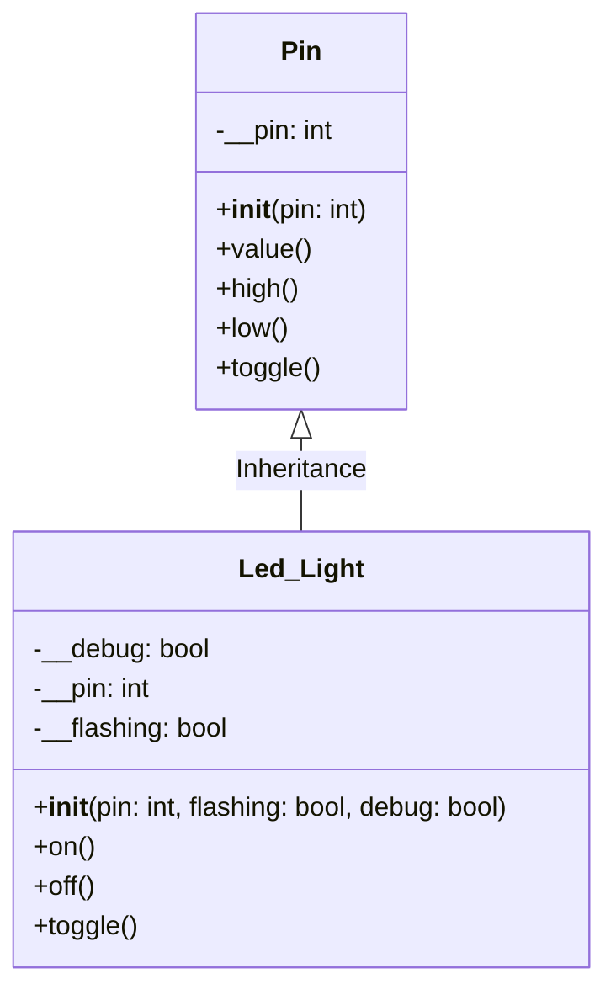

# Lecture 2

## Lecture 2 Concepts
- UML (Unified Modeling Language)
- Overriding Polymorphism
- Overloading Polymorphism

## UML Class Diagrams

What is a UML Class Diagram?
A UML (Unified Modeling Language) class diagram visually describes the structure of a system by showing its classes, their attributes (variables), methods (functions), and relationships (like inheritance).

Mermaid Markdown UML Class Diagram Example
Below is a Mermaid class diagram for a Pi Pico GPIO Pin and a custom Led_Light class that inherits from it.



Explanation:
- Pin class: Represents a generic GPIO pin on the Pi Pico.
- Attributes: id (pin number), mode (input/output).
- Methods: high(), low(), value().
- Led_Light class: Inherits from Pin and adds:
- Attributes: __debug, __pin, __flashing
- Methods: on(), off(), toggle()
- Inheritance: The arrow (<|--) shows that Led_Light is a subclass of Pin.

UML class diagrams help visualize the design and relationships of classes. Mermaid markdown provides a simple way to draw these diagrams in Markdown. Using Pi Pico’s Pin and custom Led_Light classes makes the diagram relevant to embedded hardware programming.

## Overriding Polymorphism

**Polymorphism means “many forms.”**
Overriding is when a child (subclass) provides a new implementation for a method that it inherits from its parent (superclass).

The child class method has the same name and parameters as the method in the parent class. When you call the method on a child class object, Python (or any OOP language) uses the child’s version—even if the object is referenced by the parent type.

It is called 'overriding' or also compilation polymorphism as in many langauges like C++ or C# the overridden (parent method) is not compiled at all.

```python
from machine import Pin

class Led_Light(Pin):
    # child class inherits the parent 'Pin' class
    def __init__(self, pin, flashing=False, debug=False):
        super().__init__(pin, Pin.OUT)
        self.__debug = debug
        self.__pin = pin
        self.__flashing = flashing

    def on(self):
        # method overiding polymorphism of the parent class
        self.high()
        if self.__debug:
            print(f"LED connected to Pin {self.__pin} is high")

    def off(self):
        # method overiding polymorphism of the parent class
        self.low()
        if self.__debug:
            print(f"LED connected to Pin {self.__pin} is low")

    def toggle(self):
        # method overiding polymorphism of the parent class
        if self.value() == 0:
            self.on()
        elif self.value() == 1:
           self.off()


red_light = Led_Light(3, False, False)

while True:
    red_light.on()
    sleep(1)
    red_light.off()
    sleep(1)
```

## Overloaded Polymorphism

**Polymorphism means “many forms.”**

Overloading is when a child (subclass) and or parent (superclass) has multiple methods with the same name but different parameters (number or type).

When you call the method depending on the parameters passed the coresponding method is executed.

It is called 'overloading' or also runtime polymorphism as in many langauges like C++ or C# all the methods are compiled but depending on the parameters the appropriate method is executed at runtime. 

Becuase Python is dynamically typed it does not allow Overloaded Polymorphism as the last definition of a method overwrites any previous ones.

```pseudocode
Class Led_Light inherits from Pin:
    Method __init__(pin, flashing = False, debug = False):
        Call parent class (Pin) constructor with pin and output mode
        SET led_light_state (property, see below)
        PRIVATE SET debug attribute to debug
        PRIVATE SET pin attribute to pin
        PRIVATE SET flashing attribute to flashing

    METHOD on():
        SET the pin high
        If debug is enabled:
            Print "LED connected to Pin [pin number] is [led_light_state]"

    METHOD off():
        SET the pin low
        IF debug is enabled:
            Print "LED connected to Pin [pin number] is [led_light_state]"

    METHOD toggle():
        IF pin value is 0:
            CALL on()
        ELSE if pin value is 1:
            CALL off()

    METHOD led_light_state ():
        RETURN the pin's current value

    METHOD led_light_state (value):
       IF value is 1:
            CALL off()
        ELSE IF value is 0:
            CALL on()
```

> [!Note]
> The Following Implementation is not techncially Polymorphism it is just demonstration

```python
from machine import Pin
from time import sleep, time

class Led_Light(Pin):
    # child class inherits the parent 'Pin' class
    def __init__(self, pin, flashing=False, debug=False):
        super().__init__(pin, Pin.OUT)
        self.led_light_state
        self.__debug = debug
        self.__pin = pin
        self.__flashing = flashing

    def on(self):
        # method overiding polymorphism of the parent class
        self.high()
        if self.__debug:
            print(f"LED connected to Pin {self.__pin} is {self.led_light_state}")

    def off(self):
        # method overiding polymorphism of the parent class
        self.low()
        if self.__debug:
            print(f"LED connected to Pin {self.__pin} is {self.led_light_state}")

    def toggle(self):
        # method overiding polymorphism of the parent class
        if self.value() == 0:
            self.on()
        elif self.value() == 1:
           self.off()

    @property
    def led_light_state(self):
        # method overloading polymorphism in this class
        return self.value()

    @led_light_state.setter
    def led_light_state(self, value):
        # method overloading polymorphism in this class
        if value == 1:
            self.off()
        elif value == 0:
            self.on()


red_light = Led_Light(3, False, False)

while True:
    print(red_light.led_light_state)
    red_light.led_light_state = 1
    sleep(0.25)
    print(red_light.led_light_state)
    red_light.led_light_state = 0
    sleep(0.25)
```

