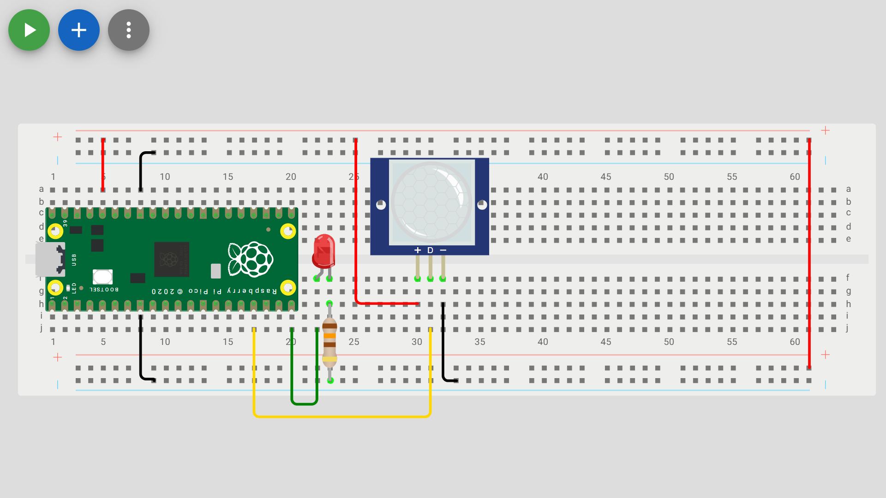

# Digital Sensor

Check out the [Wokwi Prototype](https://wokwi.com/projects/431255488937251841).

Don't forget to check the [Pi Pico Diagram](../Raspberry-Pi-Pico-pinout-diagram.svg) as you go:


## Read a digital sensor and control the LED's

| Digital Sensor Pin  | Pico pin        |
| ------------------- | --------------- |
| Ground (-, GND, G)  | Ground (GND)    |
| Data (D, SIG, OUT)  | GP13            |
| Power (+, VCC, PWR) | 3.3V (3V3(OUT)) |

> [!Note]
> Students can build using physical components or prototype using this [Template Wokwi Project](https://wokwi.com/projects/433242006092880897).



> [!Note]
> The image uses a PIR motion sensor that returns `True` when motion is sensed (sometimes holding `True` for a set period) and `False` when no motion is sensed. The sensor can be replaced by any digital sensor or even a simple switch.

```python
from machine import Pin
from time import sleep

# Wait for USB to become ready
sleep(0.1)

#store desired output pin in a variable
led_pin = 25
led2_pin = 15
data_pin = 13

#configure GPIO Pin as an output pin and create and led object for Pin class
led = Pin(led_pin, Pin.OUT)
led2 = Pin(led2_pin, Pin.OUT)

#configure GPIO Pin as an input pin and create a data object for Pin class
data = Pin(data_pin, Pin.IN)

while True:
    if data.value() == 1:
        led.value(True)  #turn on the LED
        led2.value(False)  #turn off the LED2
    else:
        led.value(False)  #turn off the LED
        led2.value(True)  #turn on the LED2
    sleep(0.1)
```

### Unit Testing

1. The onboard LED and external LED next to the USB connection should alternatively toggle on/off in response to the sensor.
