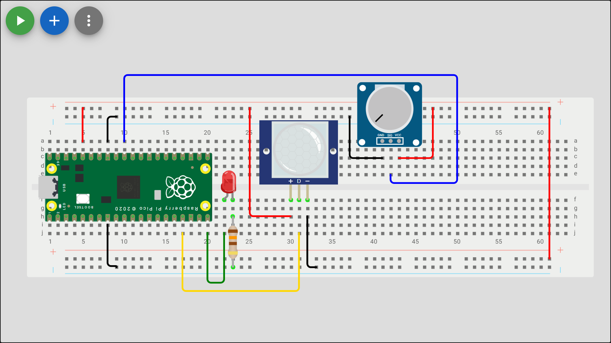

# Analog Sensor

Check out the [Wokwi Prototype](https://wokwi.com/projects/431255923839413249).

Don't forget to check the [Pi Pico Diagram](../Raspberry-Pi-Pico-pinout-diagram.svg) as you go:


## Read a analogue sensor and control the LED's

| Analog Sensor Pin   | Pico pin             |
| ------------------- | -------------------- |
| Ground (-, GND, G)  | Analog Ground (AGND) |
| Data (D, SIG, OUT)  | GP26 (ADC0)          |
| Power (+, VCC, PWR) | 3.3V (3V3(OUT))      |

> [!Note]
> Students can build using physical components or prototype using this [Template Wokwi Project](https://wokwi.com/projects/433242006092880897).



> [!Important]
> An anlog sensor must be connected to both a ADC (analog to digital converter) pin and the dedicated Analog Ground pin.

> [!Note]
> The image uses a potentiometer which is a simple variable resistor that applies no resistence at the off position and maximum resistenace at the on position with variable resistance in between. The potentiometer can be replaced by any analog sensor.

```python
from machine import Pin, ADC
from time import sleep

# Wait for USB to become ready
sleep(0.1)

#store desired output pin in a variable
led_pin = 25
led2_pin = 15
data_pin = 13
analog_data_pin = 26

#configure GPIO Pin as an output pin and create and led object for Pin class
led = Pin(led_pin, Pin.OUT)
led2 = Pin(led2_pin, Pin.OUT)

#configure GPIO Pin as an input pin and create a data object for Pin class
data = Pin(data_pin, Pin.IN)

#configure GPIO Pin as an ADC pin and create a data object for ADC class that is a composition of the Pin class
adc_value = ADC(Pin(analog_data_pin))

while True:
    if data.value() == 1:
        led.value(True)  #turn on the LED
        led2.value(False)  #turn off the LED2
    else:
        led.value(False)  #turn off the LED
        led2.value(True)  #turn on the LED2
    print(print(f"Analog: {adc_value.read_u16()}"))
    sleep(0.1)
```

> [!Note]
> The `read_u16()` method of the ADC class returns a 16-bit value (0–65535), but this is just the 12-bit value left-shifted to fill 16 bits (for compatibility with other platforms).
>
> - 0–3.3V analog input
> - 12-bit raw range (0–4095)
> - read_u16() scales this to 0–65535 in MicroPython

### Unit Testing

1. The onboard LED and external LED next to the USB connection should alternatively toggle on/off in response to the sensor.
2. The analog read value of the sensor should print to the terminal.
