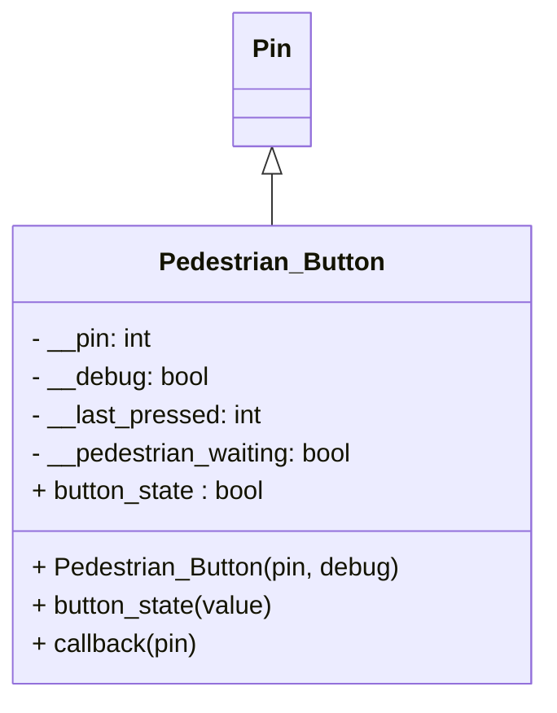

# Lecture 4

## Lecture 4 Concepts
- Implement an pedestrian button 

## Advanced Button (with Debouncing and Interrupt)

The `Pedestrian_Button`  extends the `machine.Pin`  to provide a debounced, interrupt-driven interface for a pedestrian button, with optional debug output.

### UML



### Constructor

```python
Pedestrian_Button(pin, debug=False)
```
- `pin`: The GPIO pin number the button is connected to.
- `debug`: Set to `True` to enable debug print statements.

### Example Usage

```python
from pedestrian_button import Pedestrian_Button
import time

# Create a Pedestrian_Button on GPIO pin 14 with debug enabled
button = Pedestrian_Button(22, debug=True)

while True:
    # Check if the button has been pressed (pedestrian waiting)
    if button.button_state:
        print("Pedestrian button pressed!")
        # Reset the waiting state after handling
        button.button_state = False
    time.sleep(0.1)
```

### Methods and Properties

- **button_state** (property)  
  - Gets: Returns `True` if the button is pressed or has been pressed since last reset, `False` otherwise. Prints debug info if enabled.
  - Sets: Allows manual reset of the internal waiting state.

- **callback(pin)**  
  Interrupt handler called on button press (rising edge). Handles debouncing and sets the waiting state.

---

**Notes:**  
- The button should be wired between the specified GPIO pin and GND.
- The  uses the internal pull-down resistor and sets up an interrupt for rising edge detection.
- Debouncing is handled in software (200ms).

### Class Unit Test

```python
from time import sleep
from pedestrian_button import Pedestrian_Button

# Replace 22 with the GPIO pin your button is connected to
button = Pedestrian_Button(22, debug=True)

print("Testing initial button_state (should be False if not pressed)")
initial_state = button.button_state
if initial_state is False:
    print("Initial .button_state passed")
else:
    print("Initial .button_state failed")

print("Please press and release the button within 5 seconds...")
pressed = False
for _ in range(50):
    if button.button_state:
        pressed = True
        break
    sleep(0.1)

if pressed:
    print("Button press detected: .button_state passed")
else:
    print("Button press not detected: .button_state failed")

print("Testing button_state setter (reset to False)")
button.button_state = False
sleep(0.1)
if button.button_state is False:
    print(".button_state setter passed")
else:
    print(".button_state setter failed")

print("Manual test complete.")
```
### Class Implementation

```python
from machine import Pin
import time


class Pedestrian_Button(Pin):
    # Sub Class inherits the Super 'Pin' 

    def __init__(self, pin, debug):
        super().__init__(pin, Pin.IN, Pin.PULL_DOWN)
        self.__debug = debug
        self.__pin = pin
        self.__last_pressed = 0  # Track the last time the button was pressed
        self.__pedestrian_waiting = False
        self.button_state
        self.irq(
            trigger=Pin.IRQ_RISING, handler=self.callback
        )  # Set up interrupt on rising edge

    @property
    def button_state(self):
        if self.__debug:
            print(
                f"Button connected to Pin {self.__pin} is {'WAITING' if self.__pedestrian_waiting else 'NOT WAITING'}"
            )
        return self.__pedestrian_waiting

    @button_state.setter
    def button_state(self, value):
        self.__pedestrian_waiting = value
        if self.__debug:
            print(f"Button state on Pin {self.__pin} set to {value}")

    def callback(self, pin):
        current_time = time.ticks_ms()  # Get the current time in milliseconds
        if (
            time.ticks_diff(current_time, self.__last_pressed) > 200
        ):  # 200ms debounce delay
            self.__last_pressed = current_time
            self.__pedestrian_waiting = True
            if self.__debug:
                print(f"Button pressed on Pin {self.__pin} at {current_time}ms")
```