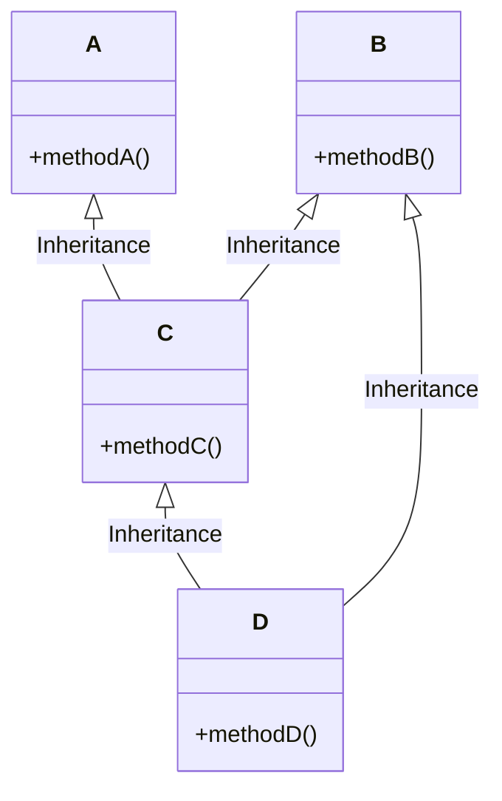
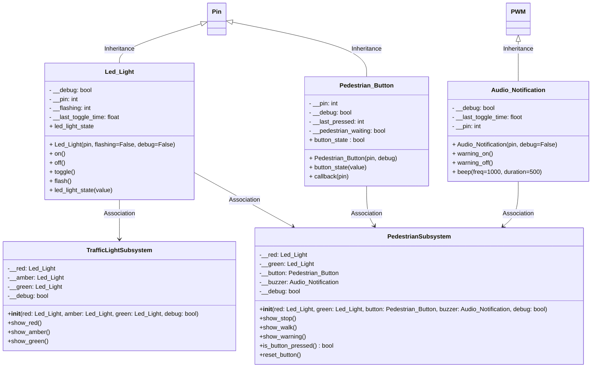

# Lecture 6

## Lecture 6 Concepts
- Multiple Inheritance
- Association
- Setup controller states

## Multiple Inheritance
Multiple Inheritance is used to inherit the properties of multiple es. However, Python does not allow multiple inheritance from es that have incompatible memory layouts at the C level, which is common with hardware es in MicroPython.



This code snippet is just to demonstrate the concept and syntax of multiple inheritance. 

```python
from led_light import Led_Light
from pedestrian_button import Pedestrian_Button
from audio_notification import Audio_Notification


class Walk_Light(Audio_Notification, Led_Light):
    def __init__(self, led_pin, buz_pin, debug):
        Led_Light.super().__init__(self, led_pin, False, debug)
        Audio_Notification.super().__init__(self, buz_pin, debug)

    def walk_on(self):
        if self.__debug:
            print("Beep and Light on")
        self.on()
        self.warning_on()

    def walk_off(self):
        if self.__debug:
            print("Beep and Light off")
        self.off()
        self.warning_off()
```

## Association

Association in Object-Oriented Programming (OOP) describes the relationship between two separate es that are connected, but neither "owns" the other. It simply means that objects of one  use or interact with objects of another .

- Association is a broad term for any relationship between classes that is not inheritance.
- It represents a "uses-a" or "knows-a" relationship.
- The lifetime of associated objects is independent—neither object controls the lifecycle of the other.

### Association UML
We will create two subsystem one for the cars and one for teh pedestrians. We will then associate the components with each subsystem.



```python

```


### Setup differnet states of the controller using association

In the context of a microcontroller, state refers to the current values or conditions of the system’s internal variables, inputs, outputs, and memory at a specific moment in time. State is crucial for determining how the microcontroller should behave next.

For example, in a simple traffic light controller, one of the states could be `Traffic_Go` in which the green lights are `on()` while both the red and amber lights are `off()`.

```python
from led_light import Led_Light
from pedestrian_button import Pedestrian_Button
from audio_notification import Audio_Notification
from time import sleep, time


class Controller:
    def __init__(
        self, ped_red, ped_green, car_red, car_amber, car_green, button, buzzer, debug
    ):
        self.__Ped_Red = ped_red
        self.__Ped_Green = ped_green
        self.__Car_Red = car_red
        self.__Car_Amber = car_amber
        self.__Car_Green = car_green
        self.__Buzzer = buzzer
        self.__Button = button
        self.__debug = debug

    def walk_on(self):
        if self.__debug:
            print("Walking")
        self.__Ped_Red.off()
        self.__Ped_Green.on()
        self.__Car_Green.off()
        self.__Car_Amber.off()
        self.__Car_Red.on()
        self.__Buzzer.warning_on()

    def walk_warning(self):
        if self.__debug:
            print("No Walking Warning")
        self.__Ped_Red.flash()
        self.__Ped_Green.off()
        self.__Car_Green.off()
        self.__Car_Amber.off()
        self.__Car_Red.on()
        self.__Buzzer.warning_off()
        
    def walk_off(self):
        if self.__debug:
            print("No Walking")
        self.__Ped_Red.on()
        self.__Ped_Green.off()
        self.__Car_Green.on()
        self.__Car_Amber.off()
        self.__Car_Red.off()
        self.__Ped_Green.off()
        self.__Buzzer.warning_off()

    def change(self):
        if self.__debug:
            print("Changing")
        self.__Ped_Red.on()
        self.__Ped_Green.off()
        self.__Car_Green.off()
        self.__Car_Amber.on()
        self.__Car_Red.off()
        self.__Ped_Green.off()
        self.__Buzzer.warning_off()
```

```python
# Alternative association method that
# encapsulates the associated objects
class Walk_Light:
    def __init__(self, led_pin, buz_pin, debug):
        self.LED = Led_Light(led_pin, debug)
        self.BUZ = Audio_Notification(buz_pin, debug)
        self.__debug = debug

    def walk_on(self):
        if self.__debug:
            print("Beep and Light on")
        self.LED.on()
        self.BUZ.warning_on()

    def walk_off(self):
        if self.__debug:
            print("Beep and Light off")
        self.LED.off()
        self.BUZ.warning_off()
```
